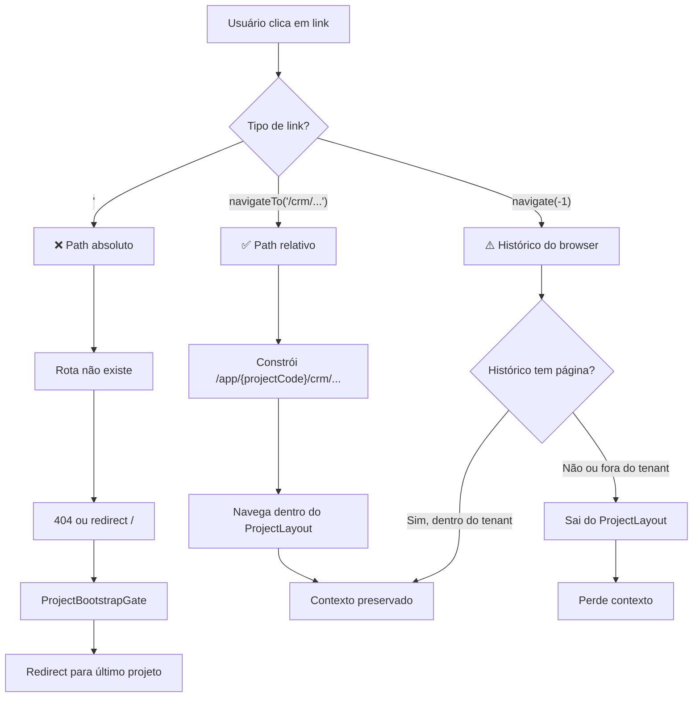

# CRM ROUTING AND NAVIGATION AUDIT

> **Auditoria Forense de Rotas, Navegação e Contexto do CRM**  
> Versão: 1.0  
> Data: 2026-01-16  
> Status: DEFINITIVO (sem correções)

---

## 📋 SUMÁRIO EXECUTIVO

Esta auditoria identifica **por que navegações quebram**, **onde contexto é perdido** e **quais decisões arquiteturais violam o padrão canônico**. O objetivo é fornecer uma base sólida para correções no PROMPT 22.

### Descobertas Críticas

| # | Problema | Severidade | Causa Raiz |
|---|----------|------------|------------|
| 1 | Links `<Link>` com paths absolutos | 🔴 Alta | Não usam `getProjectUrl()` |
| 2 | `navigate(-1)` sem contexto | 🟠 Média | Pode voltar para fora do tenant |
| 3 | CRMSubNav compara paths errados | 🟡 Baixa | `isActive()` não considera `/app/:projectCode` |
| 4 | Automações/WhatsApp na CRMSubNav | 🟡 UX | Confusão sobre escopo do CRM |

---

## 1️⃣ MAPA COMPLETO DE ROTAS DO CRM

### 1.1 Hierarquia de Rotas

```
/app/:projectCode (ProjectLayout)
├── /crm                          → CRM.tsx (Análises)
├── /crm/utm-behavior             → CRMUTMBehavior.tsx
├── /crm/kanban                   → CRMKanban.tsx
├── /crm/contact/:contactId       → CRMContactCard.tsx
├── /crm/pipeline-settings        → CRMPipelineSettings.tsx
├── /crm/activities               → CRMActivitiesDashboard.tsx
├── /crm/cadences                 → CRMCadences.tsx
├── /crm/recovery                 → CRMRecovery.tsx
├── /crm/recovery/kanban          → CRMRecoveryKanban.tsx
├── /crm/recovery/settings        → CRMRecoverySettings.tsx
├── /automations                  → AutomationFlows.tsx (fora do CRM!)
├── /automations/:flowId          → AutomationFlowEditor.tsx
├── /whatsapp                     → WhatsAppLiveChat.tsx (fora do CRM!)
```

### 1.2 Guards e Layouts

| Rota | Layout Pai | Guards | Contexto Carregado |
|------|------------|--------|-------------------|
| `/app/:projectCode/*` | `ProjectLayout` | `ProtectedRoute` | `projectCode`, `project`, `user` |
| Todas rotas CRM | `ProjectLayout` | `ProtectedRoute` | Herdam de ProjectLayout |

### 1.3 Fluxo de Bootstrap

```
App.tsx
├── ProjectBootstrapGate (aguarda auth + projetos)
│   └── Routes
│       └── /app/:projectCode
│           └── ProtectedRoute
│               └── ProjectLayout (valida acesso + carrega projeto)
│                   └── Outlet (páginas CRM)
```

**Pontos críticos:**
- `ProjectLayout` re-valida acesso a cada mudança de `projectCode`
- `ProjectBootstrapGate` redireciona para `/app/:projectCode/dashboard` se entrar em `/`

---

## 2️⃣ AUDITORIA DE LINKS INTERNOS

### 2.1 Links Problemáticos (🔴 CRÍTICOS)

#### `CustomerJourneyAnalysis.tsx:143-145`
```tsx
<Link to={`/crm/contact/${journey.contactId}`} title="Ver cartão do contato">
```
- **Problema**: Path absoluto `/crm/contact/...` sem prefixo `/app/:projectCode`
- **Comportamento**: Navega para `/crm/contact/123` (rota inválida → 404 ou redirect)
- **Causa**: Não usa `getProjectUrl()` ou `navigateTo()`
- **Classificação**: 🔴 ARQUITETURAL

#### `CustomerJourneyOrders.tsx:173-176`
```tsx
<Link to={`/crm/contact/${event.contact_id}`}>
```
- **Problema**: Mesmo problema de path absoluto
- **Classificação**: 🔴 ARQUITETURAL

#### `ContactPanel.tsx:86-91` (WhatsApp)
```tsx
<Link to={`/crm/contact/${contact.id}`}>
  Ver ficha completa
</Link>
```
- **Problema**: Cross-module navigation sem tenant prefix
- **Classificação**: 🔴 ARQUITETURAL

### 2.2 Links com `navigate(-1)` (🟠 RISCO)

#### `CRMContactCard.tsx:238`
```tsx
<Button variant="ghost" size="icon" onClick={() => navigate(-1)}>
  <ArrowLeft className="h-5 w-5" />
</Button>
```
- **Problema**: `navigate(-1)` volta para histórico, pode sair do tenant
- **Cenário de falha**: Usuário entra via link direto → voltar vai para `/projects` ou `/auth`
- **Classificação**: 🟠 LÓGICA

#### Outros locais com mesmo problema:
- `AutomationFlows.tsx:319`
- `QuizSessionViewer.tsx:64-68, 102-105`
- `DataDebug.tsx:296`
- `NotificationsHistory.tsx:186`

### 2.3 Navegações Seguras (✅ OK)

| Componente | Padrão | Status |
|------------|--------|--------|
| `CRMSubNav` | `navigateTo(item.path)` | ✅ Correto |
| `CRM.tsx` | `navigateTo('/crm/contact/${contactId}')` | ✅ Correto |
| `CRMKanban.tsx` | `navigateTo()` | ✅ Correto |
| `CRMRecovery.tsx` | `navigateTo()` | ✅ Correto |

---

## 3️⃣ CONTEXTO E STATE — ONDE ESTÁ SENDO PERDIDO

### 3.1 Problema: `isActive()` na CRMSubNav

```tsx
// CRMSubNav.tsx:88-101
const isActive = (item: NavItem) => {
  if (item.matchPaths) {
    return item.matchPaths.some(p => {
      if (p === '/crm') {
        return currentPath === '/crm'; // ❌ Compara com '/crm' literal
      }
      // ...
      return currentPath.startsWith(p); // ❌ Não considera /app/:projectCode
    });
  }
  return currentPath === item.path;
};
```

**Problema**: `location.pathname` retorna `/app/cm_abc123/crm`, mas comparação é feita com `/crm`.

**Por que funciona atualmente**: Apenas porque `startsWith('/crm')` coincidentemente funciona como substring. Mas `currentPath === '/crm'` nunca é `true`, causando highlight errado no menu "Análises".

### 3.2 Problema: Filtros Não Persistem

| Tela | Filtros | Persistência | Status |
|------|---------|--------------|--------|
| CRM Análises | search, tabs, date | URL params | ❌ Apenas state local |
| CRM Kanban | search, filters | URL params | ❌ Apenas state local |
| CRM Recovery | search, tabs, date | URL params | ❌ Apenas state local |

**Impacto**: Ao navegar para contato e voltar, filtros são resetados.

### 3.3 Problema: Re-bootstrap Desnecessário

| Cenário | Comportamento Atual | Esperado |
|---------|---------------------|----------|
| CRM → WhatsApp → CRM | Mantém projeto | ✅ OK |
| CRM → Automações → CRM | Mantém projeto | ✅ OK |
| Link direto para contato | Bootstrap completo | ✅ Esperado |
| Refresh na página | Bootstrap completo | ✅ Esperado |

**Conclusão**: O bootstrap está **correto**. O problema não é re-bootstrap, são os **links quebrados**.

---

## 4️⃣ CLASSIFICAÇÃO DOS PROBLEMAS

### 🔴 ARQUITETURAIS (Rota/Layout Errado)

| # | Problema | Arquivo | Linha |
|---|----------|---------|-------|
| 1 | `<Link to="/crm/...">` absoluto | `CustomerJourneyAnalysis.tsx` | 143 |
| 2 | `<Link to="/crm/...">` absoluto | `CustomerJourneyOrders.tsx` | 173 |
| 3 | `<Link to="/crm/...">` absoluto | `ContactPanel.tsx` | 87 |

### 🟠 LÓGICOS (Estado Resetado)

| # | Problema | Arquivo | Linha |
|---|----------|---------|-------|
| 1 | `navigate(-1)` inseguro | `CRMContactCard.tsx` | 238 |
| 2 | `navigate(-1)` inseguro | `AutomationFlows.tsx` | 319 |
| 3 | `navigate(-1)` inseguro | `QuizSessionViewer.tsx` | 64, 102 |
| 4 | `navigate(-1)` inseguro | `DataDebug.tsx` | 296 |
| 5 | `navigate(-1)` inseguro | `NotificationsHistory.tsx` | 186 |
| 6 | Filtros não persistem em URL | CRM Análises, Kanban, Recovery | Múltiplas |

### 🟡 UX (Comportamento Confuso)

| # | Problema | Arquivo | Impacto |
|---|----------|---------|---------|
| 1 | Automações na CRMSubNav | `CRMSubNav.tsx` | Usuário pensa que é parte do CRM |
| 2 | WhatsApp na CRMSubNav | `CRMSubNav.tsx` | Usuário pensa que é parte do CRM |
| 3 | `isActive()` compara errado | `CRMSubNav.tsx` | Tab "Análises" não fica ativo |

### 🟢 ESPERADOS (Não são bugs)

| # | Comportamento | Motivo |
|---|---------------|--------|
| 1 | Bootstrap em link direto | Necessário carregar contexto |
| 2 | Refresh recarrega projeto | Comportamento SPA padrão |

---

## 5️⃣ PROPOSTA DE PRINCÍPIOS (SEM IMPLEMENTAR)

### Princípio 1: Links Internos Sempre Relativos

```tsx
// ❌ NUNCA
<Link to={`/crm/contact/${id}`}>

// ✅ SEMPRE
const { getProjectUrl } = useProjectNavigation();
<Link to={getProjectUrl(`/crm/contact/${id}`)}>

// OU com Button + navigateTo
<Button onClick={() => navigateTo(`/crm/contact/${id}`)}>
```

### Princípio 2: Botão Voltar com Fallback

```tsx
// ❌ NUNCA
<Button onClick={() => navigate(-1)}>

// ✅ SEMPRE
<Button onClick={() => {
  if (window.history.length > 1) {
    navigate(-1);
  } else {
    navigateTo('/crm'); // Fallback seguro
  }
}}>
```

### Princípio 3: CRMSubNav Apenas Para Rotas CRM

```tsx
// ❌ ATUAL - Inclui módulos externos
const navItems = [
  { path: '/crm', ... },
  { path: '/automations', ... }, // ❌ Não é CRM
  { path: '/whatsapp', ... },    // ❌ Não é CRM
];

// ✅ PROPOSTO - Apenas CRM
const navItems = [
  { path: '/crm', ... },
  { path: '/crm/utm-behavior', ... },
  { path: '/crm/kanban', ... },
  { path: '/crm/activities', ... },
  { path: '/crm/recovery', ... },
];
```

### Princípio 4: Comparação de Rotas com Projeto

```tsx
// ❌ ATUAL
const isActive = currentPath === '/crm';

// ✅ PROPOSTO
const { projectCode } = useProjectNavigation();
const isActive = currentPath === `/app/${projectCode}/crm`;
```

### Princípio 5: Filtros em URL Params

```tsx
// ❌ ATUAL - State local perdido na navegação
const [search, setSearch] = useState('');

// ✅ PROPOSTO - URL params persistem
const [searchParams, setSearchParams] = useSearchParams();
const search = searchParams.get('q') || '';
```

### Princípio 6: O Que Nunca Deve Disparar Re-bootstrap

1. Navegação entre rotas do mesmo projeto
2. Mudança de tabs/filtros
3. Voltar com botão do browser dentro do tenant
4. Refresh dentro do tenant (apenas recarrega dados, não re-bootstrap completo)

---

## 6️⃣ DIAGRAMA DE FLUXO DE NAVEGAÇÃO



---

## 7️⃣ LISTA DE CORREÇÕES PRIORIZADAS

### Alta Prioridade (Bloqueia UX)

| # | Correção | Arquivo | Esforço |
|---|----------|---------|---------|
| 1 | Converter `<Link>` para `getProjectUrl()` | `CustomerJourneyAnalysis.tsx` | Baixo |
| 2 | Converter `<Link>` para `getProjectUrl()` | `CustomerJourneyOrders.tsx` | Baixo |
| 3 | Converter `<Link>` para `getProjectUrl()` | `ContactPanel.tsx` | Baixo |
| 4 | Adicionar fallback ao `navigate(-1)` | `CRMContactCard.tsx` | Baixo |

### Média Prioridade (Melhora UX)

| # | Correção | Arquivo | Esforço |
|---|----------|---------|---------|
| 5 | Remover Automações/WhatsApp da CRMSubNav | `CRMSubNav.tsx` | Baixo |
| 6 | Corrigir `isActive()` para paths completos | `CRMSubNav.tsx` | Médio |
| 7 | Adicionar fallback aos outros `navigate(-1)` | Múltiplos | Baixo |

### Baixa Prioridade (Futuro)

| # | Correção | Arquivo | Esforço |
|---|----------|---------|---------|
| 8 | Persistir filtros em URL params | CRM Análises, Kanban, Recovery | Alto |
| 9 | Criar componente `BackButton` reutilizável | Novo | Médio |
| 10 | Adicionar ESLint rule para detectar `<Link to="/...">` | ESLint config | Médio |

---

## 8️⃣ CONCLUSÃO

### Por Que o CRM "Reseta"?

1. **Links com paths absolutos** (`<Link to="/crm/...">`) navegam para rotas que não existem, causando redirect para `/` e re-bootstrap.

2. **`navigate(-1)` sem fallback** pode levar para fora do tenant se o usuário entrou via link direto.

3. **Filtros em state local** são perdidos ao navegar e voltar.

### O Que Está Correto

1. **Arquitetura de rotas** - `ProjectLayout` como wrapper é sólido.
2. **`navigateTo()`** - Funciona corretamente quando usado.
3. **Guards e proteção** - `ProtectedRoute` + `ProjectBootstrapGate` funcionam.
4. **Contexto de projeto** - Não é perdido em navegações corretas.

### Próximos Passos (PROMPT 22)

1. Corrigir os 4 links críticos com `getProjectUrl()`
2. Adicionar fallback aos `navigate(-1)`
3. Remover Automações/WhatsApp da CRMSubNav
4. Criar componente `BackButton` reutilizável
5. Considerar ESLint rule para prevenção futura

---

## 📎 REFERÊNCIAS

- `src/navigation/index.ts` — Módulo canônico de navegação
- `src/hooks/useProjectNavigation.ts` — Implementação base
- `src/components/ProjectLayout.tsx` — Layout de projeto
- `src/components/ProjectBootstrapGate.tsx` — Guard de bootstrap
- `docs/CRM_ARCHITECTURE_CANONICAL_MAP.md` — Mapa arquitetural
- `ARCHITECTURE_NAVIGATION.md` — Documentação de navegação

---

**Este documento serve como base para o PROMPT 22 (correções).**
